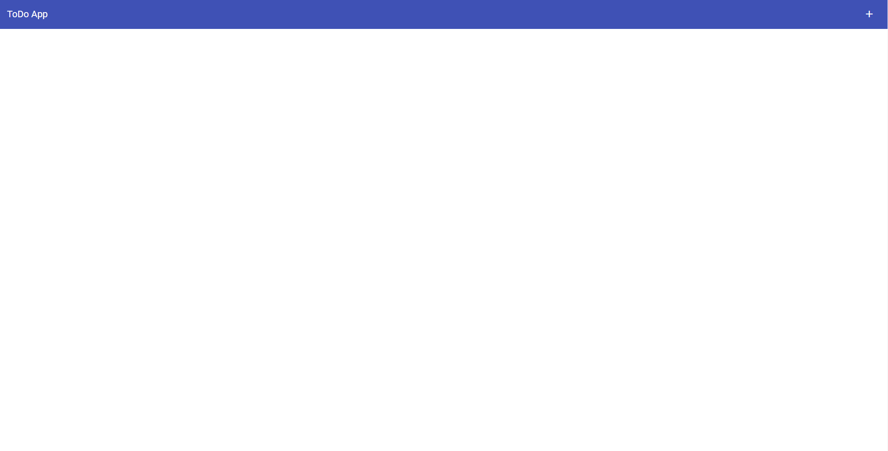
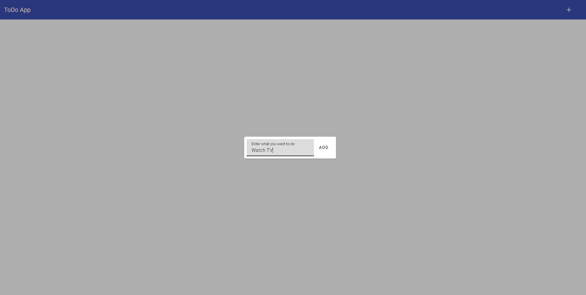
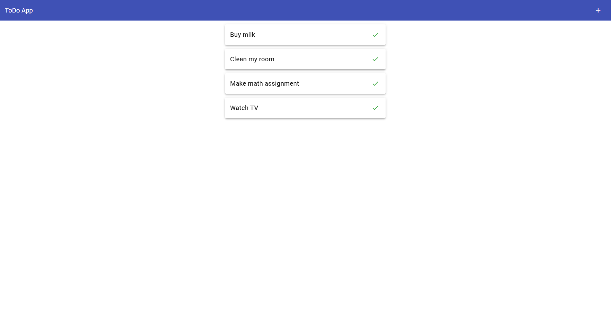

# Разработка веб-приложения с Vue.js и Firebase для ведения списка дел

## Запуск проекта

```sh
git clone https://github.com/qornev/vue-todo-app.git
cd vue-todo-app
npm install
npm run dev
```

## Скриншоты работы проекта






